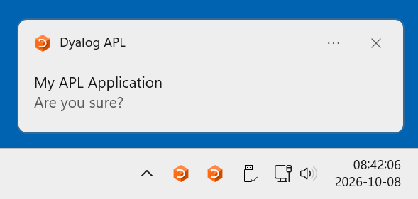

# WindowsToast

Fires a Windows toast.

## Why

A user command that runs for a while gets left alone: the user will switch to something else, and
when it finally asks a question, nobody notices that the session is sitting there waiting.


## What it looks like



## Usage

```
      ]Tatin.LoadPackages [tatin]aplteam-WindowsToast #
```

The only function `Notify` requirers two argument, "type" and "message".  Both must be strings. "type" is only used in case "message" is empty.

* If `message` is not empty it is shown while `type` is ignored
* If message is empty and `type` is not, `type` is shown, followed by " is waiting 
  for your input".

The caption of the notification is derived from `⎕WSID`. If that is empty or "CLEAR WS",
the last part of the current directory becomes the caption.


## Good behaviour

* It does not make you wait: The notification is started detached; `Notify` returns in
  about 15 ms, so a question is not held up by it.
* It never brings an application down: `Notify` traps its errors: should anything fail, 
  the question is asked anyway and `⎕DMX` is saved on `∆NotifyError`.
* It does not collide with automation `CommTools` calls the notifier only when a human is
  really asked.


## Documentation

```
      ]ADoc WindowsToast
```

or call `WindowsToast.Help`, which does the same. 

## License

MIT, see [LICENSE](LICENSE).


